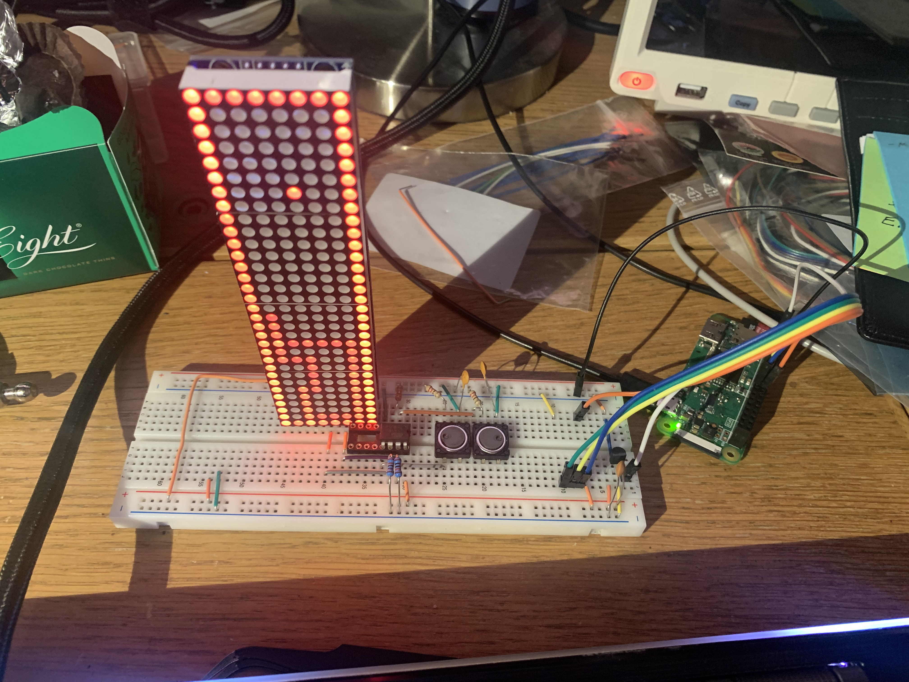

2024-01-04
# Attiny85 matopeli

## Ledimatriisissa pyörivä matopeli, kielenä AVR assembly

Harjoitusprojekti AVR assemblyyn tutustumiseksi. Oppimistavotteina lähinnä muistinhallintaan ja ajastettuihin interrupteihin tutustuminen.

## Laitteisto
- Aivoina Attiny85
- Kaksi painiketta madon kääntämiseen tyyrpuuriin/paapuuriin
- LED-matriisina [8x8x4 MAX7219-pohjainen](https://www.partco.fi/fi/arduino/arduino-leikkikenttae/19683-max7219-mod-8x8x4.html)
- Pari mielivaltaista konkkaa nappien yliampumisten torjuntaan (muutoin tuplaklikkauksia)
- Pari mielivaltaista vastusta ylös- ja alasvetoon (napit ja SPI-väylä)

</img>

## Pelin rakenne
Matopeli on matopeli, syö ruokaa, kasva, ole osumatta itseesi tai seiniin.
Normaalissa matopelissä matoa ohjataan nelisuuntaisella valitsimella (ylös/oikealle/vasemmalle/alas), mutta olin laiska ja toteutin sen yksinkertaisena tyyrpuuriin/paapuuriin-ohjauksena.
Napeille oli kaksi pinniä vapaana, eli periaatteessa olisi ollut tilaa nelisuuntauksellekin, mutta olisi pitänyt säätää sekä nappien kytkentöjen että niiden alustan kanssa. Neljä nappia rivissä kun olisi ollut vielä sekavampi kuin tyyrpuuri/paapuuri-ohjaus.
Sisäisenä pelilogiikkana on suunnilleen:
- Madolla on suunta ja pituus
- Nappi-inputilla voi kasvattaa tai vähentää suuntaa, max. kerran per ruututikkaus
- Jos seuraava piste ei ole päällä, siitä tulee madon uusi pää, ja häntä sammutetaan
- Jos piste on päällä, madon pituus kasvaa yhdellä ja häntää ei sammuteta
- Jos päällä oleva piste ei ollut ruokaa, mato kuolee ja liikkumisen sijaan vilkkuu paikallaan
- Kuoleman jälkeinen nappi-inputti aloittaa uuden pelin

## Tiedostojen rakenne
Tsemppasin ja yritin pitää homman mahdollisimman modulaarisena ja selkeänä.
Assembly-koodi on jaoteltu toiminnallisuuden mukaan, niin että `inc`-tiedostoissa on pelkkiä määritelmiä eikä käännettävää koodia ja `asm`-tiedostoissa koodi-koodi:
- `pinnit.inc`: Pinnien nimien määritelmät
- `rekisterit.inc`: Käytettävien rekisterien nimet, ei mitään R16 ymv
- `main.asm`: Päälooppi joka kutsuu muiden tiedostojen funktioita ja määrittelee interruptit
- `data.asm`: SRAM-datan määrittely ja siihen liittyvät operaatiot (pikselien arvojen togglaukset ymv)
- `mato.asm`: Madon tilaan ja ruokaan liittyvät toiminnallisuudet (liikkuminen, kasvu ymv)
- `fun_max7219.asm`: Matalan tason kommunikaatiofunktiot näyttöpiirin kanssa

Lisäksi löytyy Windows-skripti `kaanna.bat` joka kääntää yllämainitun mainin ja puskee lopputuloksen raspille (joka puolestaan hoitaa itse sirulle lykkäämisen).

## Huomioita

### Satunnaislukujen luominen assemblyllä
Tämä oli ehkä se vaikein kohta koko hommassa. Tiedän kyllä pseudosatunnaislukualgoritmeja, mutta niistä mikään ei ole oikein sellainen mistä just nyt haluaisin tehdä assembly-toteutuksen.
Sinänsä homma on simppeli, koska valittu pikselivaihtoehtoja on just se 256 kpl eli periaatteessa voisi vain arpoa koordinaattiarvon, katsoa onko se jo täytetty ja jos ei, laittaa ruoka siihen. Muussa tapauksessa sitten arpoo uuden pisteen.
Alkuun yritin että laittaisi attinyn toisen laskurin rullaamaan vinhaan tahtiin ja ottaisi sieltä aina seuraavan luvun, mutta äkkiä kävi ilmi ettei se toimi vaan jumittuu johonkin ennalta määrättyyn kohtaan.
Käy järkeen, molemmat laskurit kun pyörii saman kellon varassa niin systeemi on täysin deterministinen. Jotain satunnaisuutta saa toki siitä että pisteen syömishetki on pelaajan kämmien takia satunnainen, mutta robusti ratkaisu olisi silti kiva.
Paras mitä keksin oli että pitää yhdessä rekisterissä lukua, jota kasvatetaan aina kun vinha laskuri menee täyteen. Siinä kohtaa kun tarttisi uuden ruokapisteen, otetaan pisteen arvo tästä luvusta ja katsotaan onko se vapaa. Jos ei, kasvatetaan lukua yksi kerrallaan kunnes löytyy vapaa piste.
Pullonkaulana hommassa on se, että alin ja ylin rivi on kokonaan täytetty, eli on 2/8 todennäköisyys että tämä "satunnainen aloituspiste" osuu näistä jompaan kumpaan.
Tämä johtaa sitten siihen, että yksi kerrallaan kasvatettaessa ruokapiste siirtyy ekaan vapaaseen pikseliin, joka on aina joko oikea alanurkka tai oikean reunan eka vapaa pikseli jos mato on täyttänyt nurkan.
Kiusallista mutta silti paljon parempi kuin se että peli jähmettyisi loputtomaan looppiin.

### Interruptien kytkeminen päälle ja pois
Liittyy osittain aiemmin mainittuun satunnaislukuhommaan. Yksi alkuvaiheen toteutuksista oli sellainen, että aina kun vinhatahtisempi laskuri meni täyteen, satunnaisluvulle tehtiin sekalaisia operaatioita.
Tässä kävi kuitenkin niin, että joskus laskuri meni täyteen just kun näyttöä oltiin päivittämässä, ja koko homma meni ihan plörinäksi.
Siksi `main.asm` ruuduntäyttölooppi on ympäröity `CLI`/`SEI` ohjeistuksilla, eli kaikki interruptit pistetään näytön päivittämisen ajaksi pois päältä.
Aiemmissa projekteissa interrupteja on ollut joko tasan yksi kipale tai vähintään ne on ollu jotenkin järkevästi keskenään synkassa, eikä tämmösiä tarvinnu miettiä.
